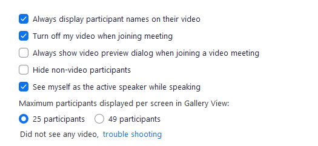
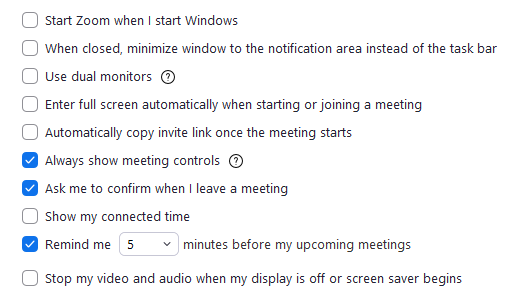

# Zoom quick join


An Automation script to *automatically* very quickly join a zoom call

This script requires your computer to be on and able to execute commands

As of right now, you have to run the script 3 times if you want to automate the joining of 3 different classes.

[Download Zoom](https://zoom.us/download#client_4meeting)

## Python Requirements:
+ Link to visit [Python Homepage](https://www.python.org)
  + On [Windows](https://www.microsoft.com/en-us/p/python-39/9p7qfqmjrfp7?activetab=pivot:overviewtab)
  + Get [pip for Python](https://pip.pypa.io/en/stable/installing/)

```commandline
cd c:/directory/to/this/project
pip install -r requirements.txt
```

## Requirements 
- [x] Installed python version above 3.5
- [x] Installed requirements.txt
- [x] Latest Zoom Software (Signed in)

# How to run the program :
* Use your favorite SVN or just go to the [Releases]() page to download the latest version
  * Extract the release into a safe spot that you will remember where it is
  
* Install pip and Python ver > `3.5`
* Open command prompt and cd to the directory
  * Install the requirements.txt using `pip install -r requirements.txt`
* Open the .bat file and click allow when prompted by windows SmartScreen
  * Yes I know the ux is *amazing* just follow the instructions and it will handle the rest
  * You can leave this on overnight and the automation will handle the rest
  
## Feel free to open a pull request or issue with any bugs or suggestions
## Upcoming:
- [ ] Better UX
- [ ] Better code with fewer dependencies
- [ ] Automation to create a task in the Task Scheduler for running the Script
- [ ] A way for this to run in the background
- [x] Multiple class support

#### Have fun, 
Leave a star * if this helped you out in any way

## Frequently asked questions / errors

* This project is 100% open source, if you can't trust allowing SmartScreen you can take a look at my code.
* Make sure to add trailing 0's for times before 10:00 AM Ex. 09:30. Do this or the program will crash.
* Make sure you do not interfere with the code by entering anything while it is executing, it will not work.

Create an [issue here](https://github.com/vippeople22/zoom-quick-join/issues) and I'll add it here 

Or make a [pull request](https://github.com/vippeople22/zoom-quick-join/pulls) and I'll update the code


# Setting up zoom
#### Audio settings


#### Video settings



#### General settings



#### Please note that these settings work however there are other combinations that work, this is just an example.
